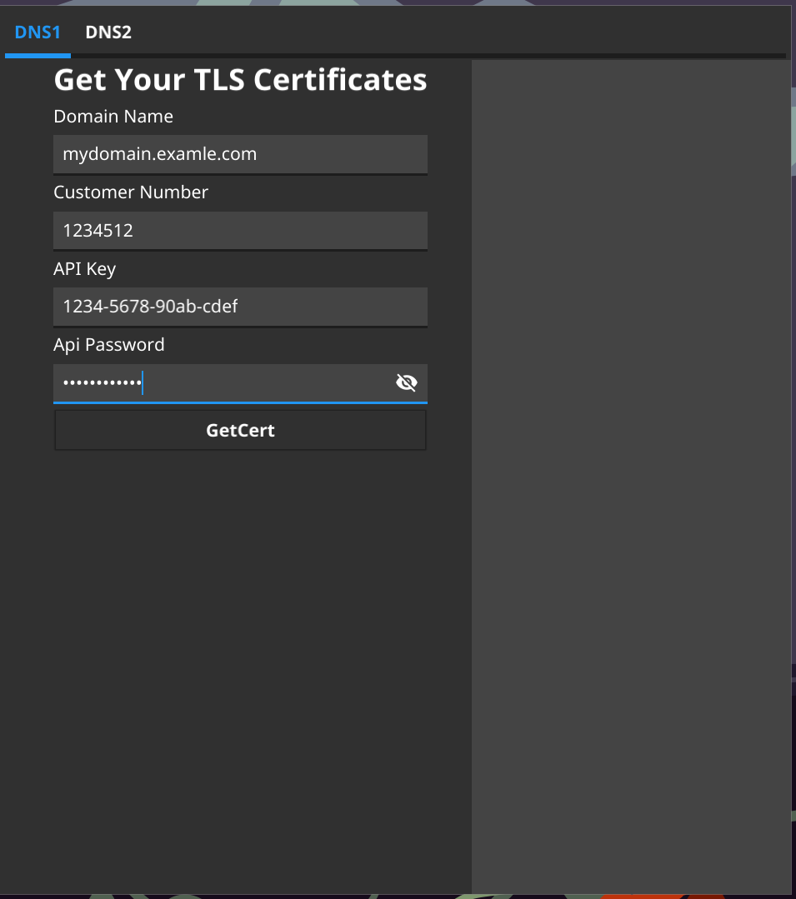

# User Documentation

## Installation

First make sure you've [GO](https://go.dev/) installed. Then clone our repository from [https://github.com/Bujuhu/lego-ui](https://github.com/Bujuhu/lego-ui), navigate to the `src` folder and execute `go run .` using the terminal.

Please keep in mind, by using this application, you are agreeing to [LetsEncrypt's Terms of Service](https://community.letsencrypt.org/tos).
 
## Usage

Currently, only Netcup is supported as a DNS Provider. First you need to find/create API credentials for Netcup's Customer Control Panel API. Follow Netcup's guide [here (German only)](https://www.netcup-wiki.de/wiki/CCP_API#Authentifizierung).

After you've gotten your authentication credentials, you can enter the desired (sub-)domain, you want to create a Certificate for, and click on "GetCert".

 Please keep in mind, that the verification will take some time, as LetsEncrypt has to wait for DNS Servers to refresh, before they can sign any Certificates. You'll be able to track the progress using the Log output on the right side of the window.
